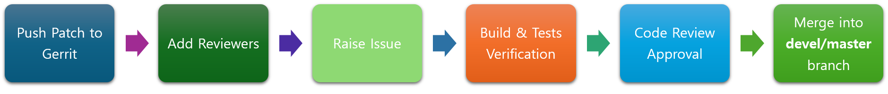

## DALi: A 3D Graphics Engine


Welcome :wave: to the **DALi Hub**, the home for the **Dynamic Animation Library (DALi)** & the **Natural User Interface (NUI)**.

### What is DALi?
* DALi targets embedded hardware and provides smooth animations at a stable 60 frames per second even on low powered devices. 
* Provides a simple C++ API for application developers to utilize the full power of **OpenGLES** (and **Vulkan** soon!).
* The UI is represented as a **3D Scene Graph**.
* **Animations** and **Transitions** are done with 3D Math (Vector, Quaternion, Matrix, etc.).
* **Rendering** and **Effects** are done utilizing Shaders, Vertices & Textures.
* Support for **3D Scenes and Models** is also provided through the Scene3D library.

### What is NUI?
* A C# wrapper on top of DALi.
* Part of the Samsung Github's TizenFX repository.
* Provides a greater range of UI widgets and effects.
* Applications built with NUI are currently in use on a range of **Samsung TVs :tv: and digital appliances** (e.g. Smart Fridges and Ovens) running Tizen.

### Cross-Platform Support
[](https://ubuntu.com/desktop)
[](https://www.tizen.org)
[](https://www.android.com)
[](https://www.apple.com/macos)

### Getting Started

To build DALi's C++ libraries, you will need to get the following repositories:
 - [DALi Core](https://github.com/dalihub/dali-core)
 - [DALi Adaptor](https://github.com/dalihub/dali-adaptor)
 - [DALi Toolkit](https://github.com/dalihub/dali-toolkit)
 - [DALi Demo](https://github.com/dalihub/dali-demo)

Please start by looking at the pre-requisites and the build instructions in [DALi Core](https://github.com/dalihub/dali-core?tab=readme-ov-file#build-instructions).

To build the C# NUI library, you will also require the following repositories:
 - [DALi CSharp Binder](https://github.com/dalihub/dali-csharp-binder)
 - [TizenFX](https://github.com/dalihub/TizenFX)

Again, each repo has instructions on the pre-requisites and build instructions.

### Contributor Guidelines
The DALi repositories on Github are just a mirror, so as such, Github pull requests are not used.
To contribute to these repos, you will have to first register an account on [Tizen.org](https://www.tizen.org/user/register).

On Tizen.org we use [ Gerrit](https://review.tizen.org/) for code reviews.

The process to contribute to these repos is as follows:


- **Push Patch to Gerrit:** Create a patch according to the [tizen gerrit commit guidelines](https://docs.tizen.org/platform/developing/contributing/) and push to the **devel/master** branch:
  ```git push origin HEAD:refs/for/devel/master```
- **Add Reviewers:** You can add the appropriate [maintainers](https://review.tizen.org/gerrit/#/admin/groups/740,members) to the patch.
- **Raise Issue:** Add an issue on Github, e.g. for DALi Core, go [here](https://github.com/dalihub/dali-core/issues). 
  This will inform :inbox_tray: the maintainers who can then review the code and then run a verification which will do the **Build & Tests Verification**.
- Any problems with this will be reported back to the committer who can then fix the problems and submit a new patchset.
- Once verified, the code will be **approved on gerrit** and then **merged** :superhero:.

To contribute to NUI, please follow the guidelines in Samsung's TizenFX repo [here](https://github.com/Samsung/TizenFX).